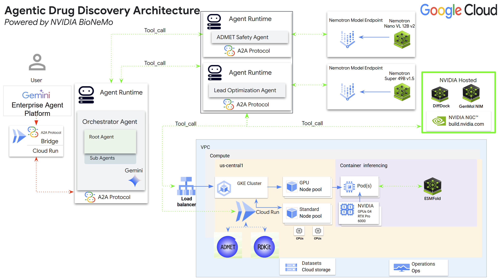

# MolForge

**An agentic AI drug-discovery platform on Google Cloud, powered by NVIDIA.**

MolForge lets medicinal chemists drive lead optimization, ADMET screening, protein folding, and
molecular docking through natural language. A chemist asks a question in
[Gemini Enterprise](https://cloud.google.com/gemini/docs/enterprise); MolForge plans the work,
fans it out across NVIDIA inference microservices and GPU workloads, and streams back a
structured scientific narrative with interactive 2D and 3D molecular renders inline in the chat.

It is a reference implementation of the NVIDIA × Google Cloud co-innovation stack: Gemini Enterprise
Agent Platform for orchestration, NVIDIA NIM and Nemotron for the science, and the open
[A2A](https://a2aproject.github.io/A2A/) and A2UI protocols for the interface.

---

## What it does

| Capability | Description |
|---|---|
| **Lead optimization** | Generate novel molecular variants of a lead compound with GenMol, score them, and rank by structure–activity relationship |
| **ADMET screening** | Run candidates through 41 absorption, distribution, metabolism, excretion, and toxicity endpoints |
| **Protein folding** | Predict 3D structure from sequence with ESMFold, with per-residue pLDDT confidence |
| **Molecular docking** | Dock ligands against a target protein with DiffDock and return ranked binding poses |
| **Target lookup** | Resolve compound names to SMILES and gene symbols to PDB structures automatically |
| **Inline visualization** | Render 2D structures and ray-traced, rotating 3D poses directly in the chat surface |

A single request can chain all of these. Ask it to *"optimize Imatinib for the KIT D816V mutation,
dock the variants against the KIT structure, and generate 5 variants"* and it resolves the target
structure, generates variants, docks each one, analyzes the SAR, and returns a ranked narrative
with renders — in one turn.

---

## Architecture



The same thing in text, which is easier to search and to quote in a diff:

```
Gemini Enterprise ──A2A / A2UI (SSE)──▶  A2A Bridge  (Cloud Run)
                                              │
                                              ▼
                            Orchestrator  (Agent Runtime)
                            Gemini 2.5 Pro · plans and delegates
                            · name → SMILES resolution
                            · RCSB / UniProt / ChEMBL lookup
              ┌───────────────────────────────┴───────────────────────────────┐
              ▼                                                               ▼
    Lead Optimizer Agent                                        ADMET Safety Agent
    Gemini 2.5 Pro driver                                       Gemini 2.5 Pro driver
    tool: optimize_lead_complete                                tool: screen_molecules_complete
      ├─▶ GenMol            NVIDIA NIM (hosted)                   ├─▶ ADMET-AI      Cloud Run
      ├─▶ DiffDock          NVIDIA NIM (hosted)                   ├─▶ RDKit *       Cloud Run
      ├─▶ ESMFold           GPU (GKE, RTX PRO 6000)               └─▶ Nemotron Nano 12B
      ├─▶ RDKit *           Cloud Run                                  Model Garden
      └─▶ Nemotron Super 49B                                           (safety reasoning)
             Model Garden (SAR reasoning)

    * RDKit is shared infrastructure — both agents call it directly.

    Supporting services (Cloud Run): render-service (2D/3D molecular imaging),
    viewer (interactive Mol* structure viewer), data-retrieval (RCSB/UniProt/ChEMBL)
```

Gemini Enterprise talks to the bridge over **A2A**. Everything below the bridge uses the Agent
Platform SDK. The orchestrator is the only component that delegates — sub-agents never call each other,
which keeps the call graph a tree and makes every request traceable end to end.

> **A note on names.** Vertex AI is now **Gemini Enterprise Agent Platform**, and Agent Engine is now
> **Agent Runtime**. The SDK, API endpoint and REST resources kept their original names, so the code
> here still reads `import vertexai`, `google-cloud-aiplatform`, `aiplatform.googleapis.com`,
> `reasoningEngines` and `adk deploy agent_engine`. Prose uses the current names; identifiers use the
> ones the platform actually accepts.

**Compute placement is deliberate.** GenMol and DiffDock run as NVIDIA-hosted NIMs, Nemotron runs
on Model Garden, and only ESMFold occupies a local GPU. This keeps a single GPU node
carrying the workload that most benefits from it, while everything else scales independently as
managed inference.

**There is no trust boundary in this diagram.** Every ingress above — the bridge, the viewer, the
render service, the three CPU services and the ESMFold load balancer — is deployed
`--allow-unauthenticated` and reachable by anyone who has the URL. That is deliberate, and it is a
proof-of-concept convenience: open ingress is what lets you stand this up in an afternoon and get
the science working end to end without first building an identity story around it. Treat it as a
starting posture rather than a finished one. **Secure it before it leaves the sandbox**, and
certainly before it goes near anything real. Between agents the picture is already different: each
service runs as its own least-privilege service account, and the bridge grants no cross-origin
browser access by default. See [Production hardening](#production-hardening).

---

## Design principles

These are the constraints that hold the system together. They are worth understanding before
extending it.

**One tool per agent.** Each sub-agent exposes exactly one tool that runs its entire pipeline in a
single Python call. LLM function-calling degrades sharply when chaining several tools that pass
large structured payloads between them; collapsing the pipeline into one call keeps the model's
job simple — decide *whether* to run it and with what parameters — and keeps the scientific
orchestration in deterministic Python where it belongs.

**No hardcoded scientific thresholds.** Ranking, triage, and traffic-light decisions come from
Nemotron reasoning with therapeutic-area context, not from constants baked into Python. A
Lipinski cutoff that is right for an oral small molecule is wrong for a PROTAC. The model sees
the context; a constant cannot.

**Narrative surfacing is verbatim.** Scientific text produced by Nemotron — SAR analysis, safety
assessments, numeric values, artifact paths — flows up the delegation chain unchanged. Agent
instructions explicitly forbid paraphrasing, so what the chemist reads is what the model that
did the analysis actually said.

**Tools return real references, never blanks.** Every tool returns resolvable paths and IDs. An
empty string in a structured response invites a language model to fill the gap with something
plausible and wrong, so tools resolve and cache real artifacts before returning.

**Deterministic artifact layout.** Every run writes to a predictable path in Cloud Storage keyed
by a short run ID. Downstream consumers resolve artifacts from that ID rather than depending on
a model to echo a long path back correctly.

---

## Repository layout

```
a2a/                       A2A bridge — protocol handling, SSE streaming, A2UI rendering
  server.py                  AgentCard, message/send + message/stream, inline render assembly
  a2ui.py                    A2UI v0.8 surface builders

agents/                    Agent Runtime agents
  orchestrator/              Planner — delegation, compound/target resolution
  lead_optimizer/            GenMol, DiffDock, ESMFold, Nemotron SAR
  admet_safety_agent/        ADMET-AI screening, Nemotron safety reasoning

services/                  Containerized inference and utility services
  render_service/            2D (RDKit) and 3D (PyMOL) molecular rendering
  esmfold/                   ESMFold protein structure prediction (GPU)
  admet_ai/                  ADMET-AI property prediction
  rdkit_service/             Descriptors, validation, canonicalization
  data_retrieval/            RCSB PDB, UniProt, ChEMBL queries

viewer/                    Interactive Mol* structure viewer (Express + React)
dashboard/                 React chat dashboard (Vite + Tailwind)
infra/gke/                 Kubernetes manifests for GKE-hosted services
assets/                    Diagrams used by the documentation
setup.sh                   Idempotent foundation provisioning
DEPLOYMENT.md              The manual deployment path, if you are not using setup.sh
```

---

## Prerequisites

- A Google Cloud project with billing enabled
- `gcloud` CLI, authenticated (`gcloud auth login`)
- `kubectl`, if you deploy the local folding tier
- **Python 3.12.** Not 3.13 or 3.14 — `google-adk` and parts of the Agent Platform SDK break on
  3.14, which is also why every Dockerfile here pins `python:3.12-slim` instead of using Buildpacks
- An **NVIDIA NGC API key** with NIM catalog access, from [ngc.nvidia.com](https://ngc.nvidia.com)
- Gemini Enterprise, for the chat interface
- GPU quota for the ESMFold node, if you deploy the local folding tier

Required APIs: `aiplatform`, `run`, `container`, `cloudbuild`, `artifactregistry`,
`secretmanager`, `storage`.

> **`google-adk` is pinned to 2.1.0 on purpose.** 2.2.0 deploys an agent that constructs fine
> locally and then reports *"failed to start and cannot serve traffic"*. If you upgrade it, change
> the pin in each agent's `requirements.txt` **and** in both cloudbuild files — they control
> different halves of the deploy.

**What it costs and how long it takes.** Budget an hour or more for a first run, most of it
container builds — the PyMOL render image alone is allowed 40 minutes, and the agent builds an
hour. On cost, the GPU node is the item to watch: it bills continuously at roughly $4.50/hour in
the reference deployment's configuration, and scaling the pool to zero does not release a held
reservation. The two Nemotron Model Garden endpoints also bill for as long as they are deployed.
Cloud Run services scale to zero and cost effectively nothing idle. `--skip-gpu` avoids the GPU
node entirely and still gives you a working stack, since GenMol and DiffDock are hosted NIMs —
only ESMFold protein folding goes away.

---

## Deployment

### The whole stack

```bash
git clone https://github.com/Google-Cloud-AI/partner-ai-nvidia.git
cd partner-ai-nvidia/02-demos/molforge
gcloud auth login
gcloud config set project <your-project-id>

bash setup.sh
```

Idempotent and safe to re-run. It enables the APIs, creates the Artifact Registry repository, the
artifacts bucket, a least-privilege service account per Cloud Run service, Workload Identity and
the Secret Manager entries; builds every image; brings up the GKE cluster with its single
Blackwell pool; deploys the Cloud Run services, the bridge and the viewer; deploys the three
agents to Agent Runtime and propagates the Engine IDs between them. It prompts for what it needs
and saves the answers to `.molforge-setup.conf`.

Use `--skip-gpu` for a control-plane-only build, `--yes` for non-interactive runs, and
`--only <phase>` to re-run one phase. The phases, in order:

```
apis  foundation  gke  build  gke-workloads  gke-urls  run  agents  ge
```

> `setup.sh` has been tested end to end against a clean project, and several of the sharper edges
> in this stack were found and fixed that way.

### By hand

If you would rather drive the deployment yourself — or `setup.sh` stopped part way and you want
to finish the job — [DEPLOYMENT.md](DEPLOYMENT.md) has the equivalent `gcloud` commands in order,
along with the handful of failure modes that are quiet enough to cost you an afternoon.

### Verify before registering

Two checks, both worth doing before you involve Gemini Enterprise — a failure here is far easier to
read than the same failure surfacing as a silent non-render in a chat window.

```bash
python3.12 -m venv .venv && source .venv/bin/activate
pip install -r agents/lead_optimizer/requirements.txt pytest httpx fastapi
python -m pytest -q                 # 38 tests, no cloud access needed
```

Install the agent requirements rather than the test libraries alone — the tests import the agent
tools, so they need the same pinned dependency set, and installing `google-adk` unpinned alongside
them produces a resolver conflict.

Then confirm the bridge is serving an AgentCard that actually negotiates rich rendering:

```bash
curl -s "https://<your-bridge-url>/.well-known/agent.json" | jq '.capabilities.extensions'
```

That must list `https://a2ui.org/a2a-extension/a2ui/v0.8`. If it is empty or absent, the bridge is
healthy but Gemini Enterprise will render text only — usually because `MOLFORGE_A2UI` was left
unset at deploy time. A `/health` check will not catch this.

### Register with Gemini Enterprise

Register the bridge's AgentCard URL as an A2A agent:

```
https://<your-bridge-url>/.well-known/agent.json
```

---

## Configuration

Agents read configuration from a `.env` file in their directory; the bridge and services read
environment variables set at deploy time.

| Variable | Component | Purpose |
|---|---|---|
| `ORCHESTRATOR_ENGINE_ID` | bridge | Agent Runtime ID the bridge delegates to |
| `LEAD_OPTIMIZER_ENGINE_ID` | orchestrator | Sub-agent delegation target |
| `ADMET_SAFETY_ENGINE_ID` | orchestrator | Sub-agent delegation target |
| `MOLFORGE_A2UI` | bridge | Set to `1` to enable inline A2UI rendering |
| `MOLFORGE_RENDER_URL` | bridge | Render service base URL |
| `MOLFORGE_VIEWER_URL` | agents | Viewer base URL for generated links |
| `MOLFORGE_CORS_ORIGINS` | bridge | Comma-separated browser origins allowed to call the bridge. Empty (the default) installs no CORS middleware at all |
| `MOLFORGE_ESMFOLD_URL` | lead optimizer | ESMFold service endpoint |
| `MOLFORGE_RDKIT_URL` | both agents | RDKit service endpoint |
| `MOLFORGE_ADMET_AI_URL` | ADMET agent | ADMET-AI service endpoint |
| `MOLFORGE_DATA_RETRIEVAL_URL` | orchestrator | RCSB / UniProt / ChEMBL lookup service endpoint |
| `MOLFORGE_ARTIFACTS_BUCKET` | agents, render, data-retrieval | Cloud Storage bucket for artifacts, renders and cached structures |
| `MOLFORGE_GCS_BUCKET` | bridge, agents | The **same bucket, second spelling.** `tools/artifacts.py` and the bridge read this name; `esmfold.py`, the render service and data-retrieval read the one above. Set both to the same value |

Two things about those endpoint variables. Their defaults are in-cluster DNS names left over from
when the CPU services ran on GKE, so an Agent Runtime agent cannot reach them — the variable is
effectively required. And an *empty* value is worse than an absent one: `os.getenv(k, default)`
returns `""` for a variable that is set-but-empty, so writing `MOLFORGE_RDKIT_URL=` into a `.env`
overrides the default with a value that cannot work. `setup.sh` skips empty pairs for this reason.

`MOLFORGE_GENMOL_URL` and `MOLFORGE_DIFFDOCK_URL` are deliberately **not** set anywhere. Both tools
default to the NVIDIA-hosted NIMs; setting either points the agent at a self-hosted NIM instead,
and DiffDock then also needs a matching `MOLFORGE_DIFFDOCK_PATH`.

The NVIDIA API key is **never** stored in configuration. It lives in Secret Manager as
`molforge-nvidia-api-key` and is fetched at runtime by the Agent Runtime service account.

---

## Try it

Once registered, in Gemini Enterprise:

> Optimize Imatinib (SMILES `Cc1ccc(NC(=O)c2ccc(CN3CCN(C)CC3)cc2)cc1Nc1nccc(-c2cccnc2)n1`) for
> the KIT D816V mutation. Dock the variants against the KIT structure and generate 5 variants.

This exercises the full stack: target structure resolution, GenMol variant generation, DiffDock
docking, Nemotron SAR analysis, and inline 2D candidate plus rotating 3D pose rendering.

---

## Inline rendering

MolForge renders molecular structures directly in the Gemini Enterprise chat surface using
**A2UI v0.8**. Four things have to be true for this to work, and all four are load-bearing:

1. The AgentCard declares the A2UI extension under `capabilities.extensions`. This — not the
   output modes list — is what negotiates rich rendering.
2. Every response carries the `X-A2A-Extensions` header.
3. Each A2UI message travels as its own A2A `DataPart`, with the mime type in part metadata.
4. Each rendered result uses a **unique surface ID**. A surface ID renders once per conversation,
   so reusing one means only the first result in a chat appears.

Over `message/stream`, A2UI parts are emitted as progressive `working` status updates and then
repeated in the terminal message. A plain-text fallback always accompanies the rich parts, so
clients without A2UI support still get the full narrative.

---

## Production hardening

This is an MVP reference implementation, tuned for demonstration and workshop use. Before running
it in a regulated or production environment, address the following:

- **Authentication — the one that must be closed.** Every Cloud Run service and the ESMFold load
  balancer deploy `--allow-unauthenticated`, so anyone holding a URL can drive the bridge, the
  agents, the GPU and your NVIDIA NIM quota. This is deliberate, and it is a proof-of-concept
  convenience: it is what lets someone clone the repo, run `setup.sh`, and have a working system
  without first standing up an identity story. That trade is fine for a sandbox you control and
  nowhere else — it is the single change this design assumes you will make, and it should be made
  before the stack is shared, demoed outside your project, or left running. Put it behind IAP, an
  internal load balancer with Private Service Connect, or an authenticated proxy, and register the
  bridge with Gemini Enterprise using a service account rather than open ingress. Nothing else in
  this list is load-bearing if this one is skipped.
- **Supply chain.** Base images are digest-pinned and every Dockerfile runs a build-time smoke
  test, so a broken image fails the build rather than production. Enable Binary Authorization on
  top of that if you need attested provenance.
- **Cost controls.** A reserved GPU node bills continuously while the reservation is held; scaling
  the node pool to zero does not release it. Set budget alerts and delete reservations you are not
  using.
- **Audit lineage.** Runs are traceable by run ID through structured logs and Cloud Storage
  artifacts, but GxP or 21 CFR Part 11 use requires formal, immutable audit records.

---

## Author

**Schneider Larbi** — Global Partner Technical Architecture, Google Cloud

---

## License

Licensed under the Apache License, Version 2.0. See [LICENSE](LICENSE) for the full text.

```
Copyright 2026 Google LLC
```

This is a reference implementation, not an officially supported Google product. MolForge is a
research and demonstration tool. It is not a medical device and its output must not be used to
make clinical decisions.
